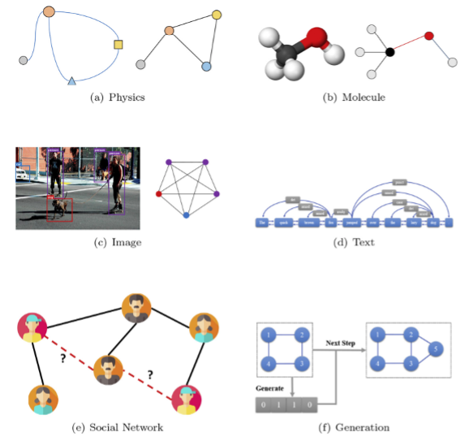
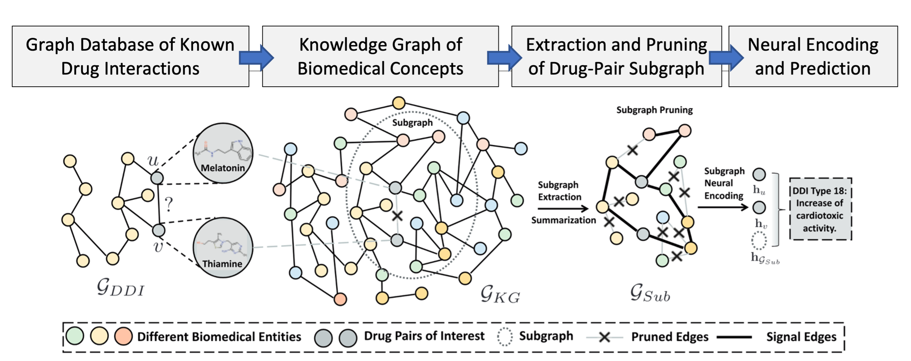
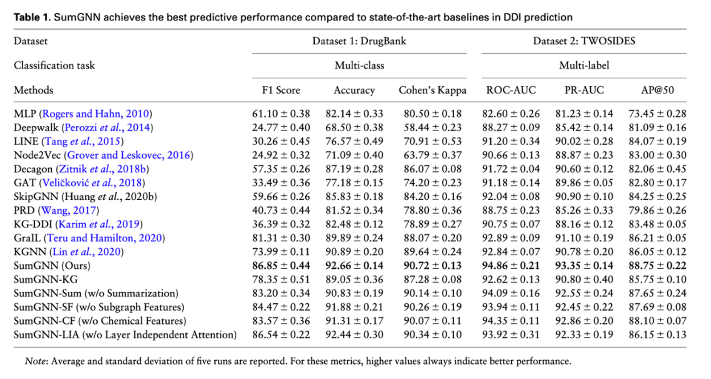
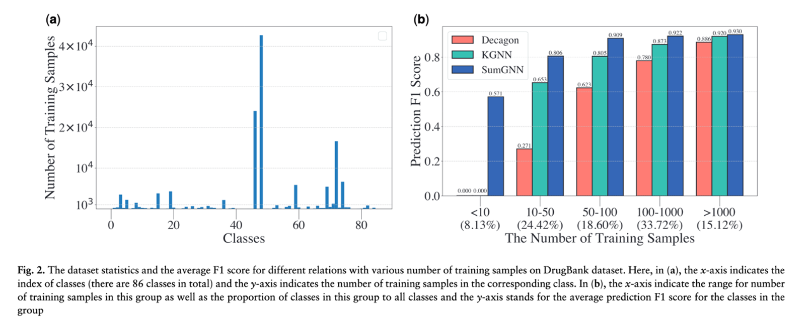

As one of the top research universities in the United States, the Georgia Institute of Technology is known for collaborating with academic and industry partners. Collaborating with these partners is one of the primary reasons why the interdisciplinary research at Georgia Tech has the reputation it does. The student researchers at Georgia Tech are working to solve complex problems and make an impact.

One of the best examples of these student researchers is Yue Yu, who I recently sat down with to talk about their research. Yue is pursuing a Ph.D. in Computational Science and Engineering (CSE) at Georgia Tech. Before starting his Ph.D. at Georgia Tech, Yue received a bachelor's degree with honors in Electronic Engineering from Tsinghua University. Early in his career during his undergraduate studies, Yue was exposed to research in graph analysis. These experiences lead Yue to make graphs a significant focus of his work. At Georgia Tech, Yue is advised in his research by Professor Chao Zhang of the CSE School in the College of Computing. Together they work on research, including work information extraction from large graphs.

Graphs are a type of data structure where relationships and structure are represented through connections between many items. Graphs are a fundamental concept in modern computing because of how frequently they appear in the world around us. Graphs show up as e-commerce categories, chemical structures, social networks, street maps, and much more.

In 2020, Yue spent his summer internship at IQVIA, which describes itself as "a leading global provider of advanced analytics, technology solutions, and clinical research services to the life sciences industry." During his time at IQVIA, Yue learned that real-world problems in life sciences are radically different from those in the laboratory. Real-world problems require scientists to find solutions when there is limited or incomplete data, which can become a significant problem in a safety-critical area like medicine.

Medical patients trust physicians to make the correct clinical decision when caring for them. Physicians, like scientists, often must make significant decisions with incomplete information. We expect that physicians will personalize the selection of medications for their patients from a wide array of options while having to analyze all the potential interactions between their choices. Negative drug-drug interactions (DDI) can result in less effective treatment – or possibly even harm the patient. Further complicating the situation, the modern physician is burdened by a constant stream of new medication options released by companies onto the market, each with unique interactions. The risk for patients of a DDI rapidly increases as the number of different drugs are used. [2] 36% of the elderly in the United States use 5 or more drugs -- 15% of those elderly patients are at high risk of a significant negative DDI. [3]

During his time at IQVIA, Yue realized how much the problems associated with insufficient data affected the results of the DDI prediction algorithms that IQVIA was building. Following this collaboration, Yue began working in a partnership made up of Georgia Tech, IQVIA, and Stanford University to find a way to overcome the problems associated with making DDI predictions using limited data. Their research collaboration led to a publication in the high-impact journal 'Bioinformatics' titled "SumGNN: Explainable Predictions of Negative Medication Interactions with Deep Graph Learning."

Yue and the team worked on solving the low-information problem by incorporating massive graphs representing medical concepts into their prediction work. Bioinformaticists build medical concept graphs by gathering evidence on patient DDI and cataloging this information in substantial public repositories. These databases, called biomedical knowledge graphs (KGs), provide a data representation for a computer to understand biomedical concepts.

However, Biomedical KGs datasets often lack complete data or contain large amounts of noise. Due to the massive size and noise of Biomedical KGs, using these IRs for DDI detection remains an open problem. Approaches in the past have either ignored KGs or partially attempted to incorporate their knowledge. To solve these problems in "SumGNN," Yue and the team demonstrated a novel method to incorporate Biomedical KGs into prediction tasks. Their new method outperformed the other state-of-the-art methods on DDI prediction, especially when the amount of available drug data was very low.

"SumGNN" solved these problems by using three components. The first component is a module for subgraph extraction, which anchors its work on the most relevant subgraph in the Biomed KG. The second component is the summarization module that relies on the popular self-attention mechanism to provide Physicians with reasons behind the predictions. Finally, the third module integrates multiple channels of knowledge and data from the external Biomed KG with the DDI dataset to provide highly accurate multi-label predictions, even when there is little data.

For their research, the team used two well-known DDI databases. The first was DrugBank [4, 5] which contains 1,709 drugs (nodes) and 136,351 drug pairs (edges). DrugBank labels each drug interaction with one of 86 types of adverse pharmacological reactions. The second dataset was TWO-SIDES [6] which contains 645 drugs (nodes) and 46,221 drug-drug pairs (edges) with 200 different drug side effect types as labels. For the Biomedical KG, the team selected HetioNet [7]. HetioNet is a KG generated from 29 heterogenous public databases of genes, compounds, diseases, and more. The network combines over 50 years of biomedical information into a single resource, consisting of 47,031 nodes (11 types) and 2,250,197 relationships (24 types).
 
The SumGNN team exhaustively compared their work against the most well-known baselines in Bioinformatics research for the DDI prediction task. During our conversation, Yue told me how difficult it was to reproduce the results from many solutions they wanted to compare SumGNN against. Yue said that while it took a great deal of effort, it was crucial in convincing other scientists. Table 1 from their research showed how SumGNN outperformed the best baselines by up 5.54% -- a very significant improvement! Yue talked with me about how their choice of the F1 metric to judge their work was critical because they wanted to weigh all classes evenly to penalize their model for wrong guesses when there was limited data.

The benefits of SumGNN can be seen above in Figure 2a, which shows how in drug datasets, there is a very uneven distribution in the amount of data available for analysis. Keeping this in mind, in Figure 2b, we can see how the performance gain of SumGNN is very significant. The improvement is most noticeable when the number of training samples is meager. Yue made sure to point out how even when the amount of data available does increase, SumGNN still outperforms the baseline methods. For Yue and the team, this was a great demonstration of the generalizability of SumGNN. Yue said he was very proud of these results and emphasized to me how the low-data performance and generalizability of SumGNN was what IQVIA needed most of all.

# References

1. Yu Y, Huang K, Zhang C, et al.: SumGNN: Multi-typed drug interaction prediction via efficient knowledge graph summarization [Internet]. Bioinformatics 2021; 37:2988–2995 Available from: http://dx.doi.org/10.1093/bioinformatics/btab207

2. Tannenbaum C, Sheehan NL (July 2014). "Understanding and preventing drug-drug and drug-gene interactions." Expert Review of Clinical Pharmacology. 7 (4): 533–44. doi:10.1586/17512433.2014.910111. PMC 4894065. PMID 24745854.

3. Qato DM, Wilder J, Schumm LP, Gillet V, Alexander GC (April 2016). "Changes in Prescription and Over-the-Counter Medication and Dietary Supplement Use Among Older Adults in the United States, 2005 vs 2011". JAMA Internal Medicine. 176 (4): 473–82. doi:10.1001/jamainternmed.2015.8581. PMC 5024734. PMID 26998708.

4. Ryu J.Y. et al. (2018 ) Deep learning improves prediction of drug-drug and drug-food interactions . Proc. Natl. Acad. Sci. USA , 115 , E4304 –4311 .

5. Wishart D.S. et al. (2018 ) Drugbank 5.0: a major update to the drugbank database for 2018 . Nucleic Acids Res ., 46 , D1074 –D1082 .

6. Tatonetti N.P. et al. (2012 ) Data-driven prediction of drug effects and interactions . Sci. Transl. Med ., 4 , 125ra31

7. Himmelstein D.S. , Baranzini S.E. (2015 ) Heterogeneous network edge prediction: a data integration approach to prioritize disease-associated genes . PLoS Comput. Biol ., 11, e1004259.
